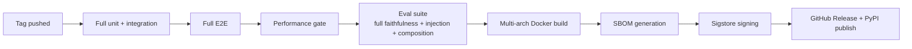

# transduce — Phased Development Plan

> **Source documents:** `docs/overview.md`, `docs/pitch.md`, `docs/system-design.md`
> **Status:** Pre-implementation. This plan governs build sequencing, test gates, and release criteria from v0 through v2.
> **Plan version:** 1.0

---

## Table of contents

1. [Plan principles](#plan-principles)
2. [Cross-cutting standards](#cross-cutting-standards)
3. [Phase 0 — Foundation](#phase-0--foundation)
4. [Phase 1 (v0) — API skeleton, Ollama, 3 modes, basic scorers](#phase-1-v0--api-skeleton-ollama-3-modes-basic-scorers)
5. [Phase 2 (v0.5) — Ensemble verifier, plugin allowlist, injection fence](#phase-2-v05--ensemble-verifier-plugin-allowlist-injection-fence)
6. [Phase 3 (v1) — Backends, composition, streaming, budget, language, OTel](#phase-3-v1--backends-composition-streaming-budget-language-otel)
7. [Phase 4 (v1.5) — Batch, MCP, benchmark, attention probes, introspection](#phase-4-v15--batch-mcp-benchmark-attention-probes-introspection)
8. [Phase 5 (v2) — Marketplace metadata, multi-tenant, signed-only, Rust hot path](#phase-5-v2--marketplace-metadata-multi-tenant-signed-only-rust-hot-path)
9. [Test taxonomy and gates](#test-taxonomy-and-gates)
10. [Release process](#release-process)
11. [Risk register and rollback policy](#risk-register-and-rollback-policy)

---

## Plan principles

| Principle | Mechanism |
|---|---|
| Test-gated phases | No phase is "done" until exit criteria are objectively met. CI gates block release on failure. |
| Coverage thresholds enforced | 80% overall, 90% new/modified code, 95% critical paths (verification, plugin loading, injection scanner). Coverage drop blocks PR merge. |
| Entry criteria are objective | Each phase begins only when its prior phase's exit criteria are green and the test fixtures listed are committed. |
| Pipeline-bisectable commits | Every commit on `main` builds, lints, type-checks, and passes its committed tests. Commits violating bisectability are rebased before merge. |
| Security gates per phase | Secret scanning, dependency CVE check, plugin signature verification (from Phase 2 onward) run in CI. |
| Phased scope refusal | Items not in the current phase's deliverable list are not implemented in that phase, even if "easy." Scope creep is the documented #1 cause of v0.5 slip in the source pitch. |
| Documentation co-shipped | Every public surface added in a phase ships its OpenAPI schema, contributor doc, and example update in the same PR. |
| Roadmap honesty | Phase timelines are PERT estimates: best/likely/worst. Slip beyond `worst` triggers a scope review, not a deadline push. |

---

## Cross-cutting standards

These apply to every phase. Violations are CI-blocking.

### Toolchain

| Concern | Choice | Enforcement |
|---|---|---|
| Python version | 3.12+ | `pyproject.toml` `requires-python = ">=3.12"`; CI runs against 3.12 and 3.13 |
| Package manager | `uv` only | Pre-commit hook rejects `pip install` invocations in shell scripts |
| Type checking | `mypy --strict` | CI gate; no `Any` permitted except at boundary serialization |
| Lint / format | `ruff check`, `ruff format --check` | CI gate; pre-commit hook |
| Test runner | `pytest` with `pytest-asyncio`, `pytest-cov`, `pytest-xdist` | Coverage report uploaded as CI artifact |
| HTTP framework | Litestar 2.x | Pinned major version |
| Schema | Pydantic v2 | All API contracts are `BaseModel` subclasses |
| Secret scanning | `gitleaks` + `pip-audit` | Pre-commit hook + CI gate |
| Containers | `docker buildx` multi-arch (amd64, arm64) | Phase 1 onward |

### Repository layout

```
transduce/
  src/transduce/
    api/                  # Litestar routes, request/response models
    pipeline/             # 7-stage orchestration
    registry/             # Mode loading (allowlist + sha256)
    backends/             # Provider adapters (one file per provider)
    verification/         # Scorer ensemble + composite verifier
    diff/                 # diff-match-patch-python wrapper
    budget/               # Cost budgeter
    language/             # fasttext-langid wrapper
    injection/            # Spotlighting fence + scanner
    observability/        # OTel GenAI SemConv setup
    config/               # YAML + env loader
    cli/                  # `transduce serve`, `transduce mcp serve`
  tests/
    unit/                 # mirror src/ structure; no I/O
    integration/          # real Ollama, real fastembed, real NLI
    e2e/                  # full HTTP flow with running service
    fixtures/             # shared factories
    eval/                 # transduce-faithfulness corpora (Phase 4)
  docs/                   # user-facing docs (already exists)
  .docs/                  # internal planning, architecture decisions
  pyproject.toml
  uv.lock
  .pre-commit-config.yaml
  .github/workflows/      # CI definitions
  Dockerfile
  docker-compose.yml      # Phase 1 onward
  transduce.example.yaml
```

### Test taxonomy

| Category | Marker | Latency budget | Network/IO allowed | Runs on |
|---|---|---|---|---|
| Unit | `@pytest.mark.unit` | <100 ms each | No | Every commit |
| Integration | `@pytest.mark.integration` | <5 s each | Yes (testcontainers, in-process Ollama) | Every PR |
| End-to-end | `@pytest.mark.e2e` | <60 s each | Yes (full service via docker-compose) | Every PR (gated subset on PR; full on `main`) |
| Eval (Phase 4+) | `@pytest.mark.eval` | <30 min suite | Yes | Nightly + pre-release |
| Performance | `@pytest.mark.perf` | <10 min suite | Yes | Pre-release |
| Security | `@pytest.mark.security` | <5 min suite | No | Every PR |

### Coverage policy

| Scope | Threshold |
|---|---|
| Overall codebase | 80% |
| New/modified code in PR | 90% |
| Critical-path modules (`verification/`, `injection/`, `registry/`, `budget/`) | 95% |
| Generated code, `__init__.py`, `cli/` entry points | excluded |

Enforced via `pytest-cov` + `coverage.py` with `--cov-fail-under` per scope and the `diff-cover` tool for new-code coverage.

### Test naming and structure

```python
# correct
def test_cosine_scorer_below_threshold_returns_reject():
    # Arrange
    scorer = CosineSimilarityScorer(threshold=0.85)
    original = "..."
    candidate = "..."

    # Act
    result = scorer.score(original, candidate)

    # Assert
    assert result.verdict == "reject"
    assert result.value == pytest.approx(0.62, abs=0.01)
```

Every test follows `test_<unit>_<scenario>_<expected_outcome>` and AAA structure. One logical assertion per test.

### Security gates (every phase)

| Gate | Tool | Block on |
|---|---|---|
| Secret scanning | `gitleaks` | any high-entropy match |
| Dependency CVEs | `pip-audit` | any HIGH or CRITICAL |
| SAST | `bandit` | any HIGH severity |
| License compatibility | `pip-licenses` allowlist | non-allowlisted license |
| Plugin signature (Phase 2+) | `sigstore-python` | unsigned mode in production config |

---

## Phase 0 — Foundation

**Goal:** Repository, CI, toolchain, fixtures, and test harness ready before any feature code lands.

**Effort (PERT):** best 2 days · likely 3 days · worst 5 days · single developer

**Entry criteria:** None. This is the first phase.

### Deliverables

| ID | Item | Acceptance |
|---|---|---|
| F-01 | `pyproject.toml` with pinned dev dependencies (pytest, mypy, ruff, pytest-cov, pytest-asyncio, pytest-xdist, gitleaks, pip-audit, bandit) | `uv sync` succeeds on a clean clone |
| F-02 | Pre-commit config: ruff, ruff-format, mypy, gitleaks | `pre-commit run --all-files` passes |
| F-03 | GitHub Actions workflow: lint + typecheck + unit tests + coverage report + secret scan | First CI run green on an empty `tests/unit/test_meta.py::test_truth` |
| F-04 | Repository layout (empty packages with `__init__.py`) per [Cross-cutting standards](#cross-cutting-standards) | `tree src/transduce` matches the layout |
| F-05 | `tests/fixtures/` with text corpora for the verification scorers (good/bad pairs, negation flips, entity swaps, number perturbations) | 200+ labeled pairs across 6 failure categories |
| F-06 | `Makefile` (or `justfile`) with `test`, `lint`, `typecheck`, `cov`, `serve` targets | All targets succeed on empty implementation |
| F-07 | `LICENSE` (Apache 2.0), `CONTRIBUTING.md`, `CODE_OF_CONDUCT.md`, `SECURITY.md` | All four committed |
| F-08 | `transduce.example.yaml` with placeholder values matching `docs/system-design.md` | YAML parses with no extra/missing keys vs the schema once Phase 1 lands |
| F-09 | `.dockerignore`, base `Dockerfile` (Python 3.12-slim), `docker-compose.yml` shell with Ollama service | `docker compose build` succeeds |
| F-10 | ADR template under `.docs/adr/` and `0001-record-architecture-decisions.md` | First ADR committed |

### Tests in this phase

This phase produces test *infrastructure*, not feature tests. Required:

- `tests/unit/test_meta.py::test_pytest_works` — sanity check
- `tests/conftest.py` — shared fixtures: `tmp_config`, `text_pairs`, `negation_pairs`, `entity_pairs`, `number_pairs`
- A failing example (`@pytest.mark.skip(reason="phase-1")`) for each Phase 1 deliverable so the test harness shape is committed before features are written

### Exit criteria

All must be objectively true:

- [ ] `uv sync && uv run pytest` exits 0 on a clean clone
- [ ] CI pipeline green on `main` for at least one commit
- [ ] `mypy --strict src/transduce` exits 0
- [ ] `ruff check src/ tests/` and `ruff format --check src/ tests/` exit 0
- [ ] Coverage report generated and uploaded as CI artifact
- [ ] Secret scan green
- [ ] `tests/fixtures/` contains the 6 corpora (each with ≥30 labeled pairs)
- [ ] First ADR merged

### Risks

| Risk | Mitigation |
|---|---|
| Time spent on infra delays user-visible progress | Hard cap 5 days; if exceeded, ship a minimal v0 in parallel and harden infra in Phase 1 |
| Fixtures inadequate for later verifier work | Treat fixture corpora as a living artifact; expand each phase |

---

## Phase 1 (v0) — API skeleton, Ollama, 3 modes, basic scorers

**Goal:** Ship a working local-first transformation service with cosine + preservation verification. Demonstrable end-to-end on a developer laptop running Ollama.

**Effort (PERT):** best 4 days · likely 6 days · worst 9 days

**Source mapping:** `docs/overview.md` v0 row, `docs/pitch.md` Time budget v0, `docs/system-design.md` §High-Level Architecture (subset).

**Entry criteria:**

- Phase 0 exit criteria all green
- Ollama installed locally with `qwen2.5:14b` pulled
- Test fixture corpora committed

### Deliverables

#### API & request lifecycle

| ID | Item | Acceptance |
|---|---|---|
| P1-API-01 | `POST /v1/transform` Litestar route with Pydantic v2 request/response models per `docs/system-design.md` §Data Models (subset: no streaming, no compose chain, no language, no cost) | Returns 200 with the response shape on a valid request |
| P1-API-02 | `GET /v1/modes`, `GET /v1/modes/{id}` | Lists 3 seed modes; per-mode detail returns `ModeSpec` |
| P1-API-03 | `GET /v1/backends`, `GET /v1/scorers` | Lists configured backends and scorers |
| P1-API-04 | `GET /healthz`, `GET /readyz`, `GET /metrics` | `/metrics` exposes basic counters |
| P1-API-05 | Schema validation at ingress; reject 400 with details on bad input | Malformed JSON, missing fields, oversized text all rejected |
| P1-API-06 | Error response envelope per `TransformError` schema | All non-2xx return the documented error shape |

#### Pipeline & orchestration

| ID | Item | Acceptance |
|---|---|---|
| P1-PIPE-01 | 5-stage pipeline (resolve → generate → verify → retry → diff) wired with explicit stage boundaries | Each stage emits a structured log line |
| P1-PIPE-02 | Single-mode dispatch only (no compose chains) | Compose request returns 400 `not_implemented` |
| P1-PIPE-03 | In-pipeline retry up to `max_retries` (default 3, hard ceiling 5) on verification failure with naive prompt-tightening | Retry count reflected in response |

#### Mode registry

| ID | Item | Acceptance |
|---|---|---|
| P1-REG-01 | Static registry loaded from a hardcoded list of 3 in-tree modes (no plugin discovery yet) | `/v1/modes` returns 3 entries |
| P1-REG-02 | `ModeSpec` Pydantic model with `id`, `version`, `prompt_template` (Jinja2), `intensity_range`, `preserve_defaults`, `verifier_profile` (subset: cosine + preservation only) | Schema validated at startup |
| P1-REG-03 | Three seed modes: `dejargon`, `register.casual`, `length.normalize` with prompt templates and tuned default thresholds | Each mode produces accept verdicts on its corresponding fixture corpus ≥85% of the time on `qwen2.5:14b` |

#### Backend adapter

| ID | Item | Acceptance |
|---|---|---|
| P1-BACK-01 | `Backend` Protocol per `docs/system-design.md` §Backend Adapter Layer (subset: `generate`, `health`; no `stream`, no `cost_estimate`) | Type-checks under `mypy --strict` |
| P1-BACK-02 | `OllamaBackend` implementation against `localhost:11434` | Health check returns true when Ollama is up |
| P1-BACK-03 | Backend selection: explicit override → service default | Documented in `docs/system-design.md` |

#### Verification

| ID | Item | Acceptance |
|---|---|---|
| P1-VER-01 | `CosineSimilarityScorer` using `fastembed` with `bge-small-en-v1.5` ONNX model | Returns score ∈ [0, 1]; latency <50 ms CPU on 500-char input |
| P1-VER-02 | `EntityPreservationScorer` using spaCy `en_core_web_sm` with exact-string match (no substring fuzzing) | Detects entity drops at 100% recall on fixture corpus |
| P1-VER-03 | `NumberPreservationScorer` with decimal-aware extraction (`(value, unit, magnitude)` triples) | Distinguishes `0.012` from `0.12` in fixture corpus |
| P1-VER-04 | `UrlPreservationScorer` | All URLs in original present in candidate |
| P1-VER-05 | Sequential scorer pipeline with first-fail short-circuit | Scorer order matches `docs/system-design.md` §Verification Subsystem |

#### Diff

| ID | Item | Acceptance |
|---|---|---|
| P1-DIFF-01 | Word-level diff via `diff-match-patch-python` with semantic cleanup | Output validated against golden snapshots |

#### Configuration

| ID | Item | Acceptance |
|---|---|---|
| P1-CFG-01 | YAML config loader with env var substitution; schema validated by Pydantic at startup | Bad config fails fast with actionable error |
| P1-CFG-02 | `transduce serve --config <path>` CLI entry point | Service starts on configured port |

### Tests

#### Unit tests

| Coverage area | Tests |
|---|---|
| `verification/cosine.py` | `test_cosine_identical_returns_1.0`, `test_cosine_below_threshold_returns_reject`, `test_cosine_handles_empty_input_raises_value_error`, `test_cosine_unicode_normalization` |
| `verification/entity.py` | `test_entity_preserved_returns_pass`, `test_entity_dropped_returns_reject`, `test_entity_substring_no_false_positive` (Apple vs Apple Inc), `test_entity_unicode_handling` |
| `verification/number.py` | `test_number_decimal_distinguished_0.012_vs_0.12`, `test_number_with_unit_preserves_unit`, `test_number_magnitude_word_preserved` (94B vs 94 billion) |
| `verification/url.py` | `test_url_dropped_returns_reject`, `test_url_with_query_string_preserved`, `test_url_idn_handling` |
| `verification/pipeline.py` | `test_pipeline_first_fail_short_circuits`, `test_pipeline_all_pass_returns_accept` |
| `pipeline/orchestrator.py` | `test_pipeline_retry_increments_count`, `test_pipeline_max_retries_returns_422`, `test_pipeline_retry_zero_disables_retry` |
| `backends/ollama.py` | `test_ollama_payload_construction`, `test_ollama_timeout_raises_generation_failed`, `test_ollama_unreachable_raises_backend_unavailable` (mocked HTTP only) |
| `registry/static.py` | `test_registry_loads_three_seed_modes`, `test_registry_unknown_mode_id_raises_mode_not_found` |
| `diff/word_level.py` | `test_diff_identical_returns_single_equal_op`, `test_diff_full_replacement_returns_delete_then_insert`, `test_diff_semantic_cleanup_groups_adjacent_changes` |
| `api/transform.py` | `test_transform_invalid_json_returns_400`, `test_transform_missing_mode_returns_400`, `test_transform_oversize_input_returns_400_input_too_long` |
| `api/errors.py` | `test_error_envelope_contains_request_id`, `test_error_codes_match_enum` |

**Coverage target:** 95% on `verification/`; 90% elsewhere.

#### Integration tests

These hit a real Ollama (started via `docker compose up ollama` in CI with a small model `qwen2.5:1.5b` for speed) and real fastembed.

| Scenario | Test |
|---|---|
| Real Ollama + real cosine | `test_transform_dejargon_real_backend_returns_accept_on_jargon_input` |
| Real Ollama + entity preservation | `test_transform_register_casual_preserves_named_entity_acme` |
| Real Ollama + number preservation | `test_transform_dejargon_preserves_dollar_amount_4_2_million` |
| Retry on rejection | `test_transform_low_threshold_triggers_retry_then_accepts` |
| Retry exhaustion | `test_transform_impossible_threshold_returns_422_after_max_retries` |
| Backend unreachable | `test_transform_ollama_down_returns_503` |
| Health checks | `test_readyz_returns_503_when_ollama_unreachable`, `test_readyz_returns_200_when_all_green` |

**Coverage target:** every public API endpoint exercised at least once with a real backend.

#### End-to-end tests

Full HTTP flow against a `docker compose` stack (transduce + Ollama).

| Flow | Test |
|---|---|
| Happy path: dejargon | `test_e2e_post_transform_dejargon_returns_200_with_diff_and_scores` |
| Happy path: register.casual | `test_e2e_post_transform_register_casual_returns_lower_register_text` |
| Happy path: length.normalize | `test_e2e_post_transform_length_normalize_280_truncates_within_bound` |
| Modes catalog | `test_e2e_get_modes_returns_three_seed_modes` |
| Bad input | `test_e2e_post_transform_oversize_input_returns_400` |
| Mode not found | `test_e2e_post_transform_unknown_mode_returns_404` |
| Metrics endpoint | `test_e2e_get_metrics_emits_transduce_requests_total_after_request` |

**Performance gate:**

- p50 single-request latency on `qwen2.5:1.5b` < 2 s end-to-end
- p99 < 5 s
- Service starts in < 10 s including model registry load

### Exit criteria

- [ ] All Phase 1 deliverables merged
- [ ] Unit coverage ≥90% (95% on `verification/`)
- [ ] Integration suite green against `qwen2.5:1.5b` Ollama in CI
- [ ] E2E suite green against `docker compose` stack
- [ ] Performance gate met
- [ ] OpenAPI spec auto-generated by Litestar matches the documented surface
- [ ] `transduce.example.yaml` produces a working service
- [ ] CHANGELOG entry written
- [ ] Tag `v0.0.1` cut

### Risks

| Risk | Mitigation |
|---|---|
| Ollama installation friction in CI | Use `ollama/ollama` Docker image with model preloaded into a layer-cached volume |
| `bge-small` model download bloats Docker image | Bake into a base image; mount as a read-only volume |
| 3 modes too few to demonstrate value | Acceptable for v0; Phase 3 adds 5 more |
| Cosine threshold tuning swallows cycles | Hardcode 0.85 as documented; tuning is Phase 4 (eval harness) |

---

## Phase 2 (v0.5) — Ensemble verifier, plugin allowlist, injection fence

**Goal:** Replace cosine-only verification with the ensemble (cosine + negation diff + bidirectional NLI + HHEM + preservation rules) per `docs/system-design.md` §Verification Subsystem. Replace static mode list with allowlist-loaded plugins. Add Spotlighting fence and ingress injection scanner. Replace naive retry with targeted-feedback retry.

**Effort (PERT):** best 12 days · likely 18 days · worst 25 days

**Source mapping:** `docs/system-design.md` §§Verification Subsystem, Mode Registry, Injection Scanner.

**Entry criteria:**

- Phase 1 exit criteria all green
- `transduce-faithfulness` corpus seed (200+ negation, antonym, tense, number, entity, fact-drift pairs) committed in `tests/eval/`
- HHEM-2.1 and MiniCheck-FT5 model weights mirrored to a CI-accessible artifact store

### Deliverables

#### Ensemble verification

| ID | Item | Acceptance |
|---|---|---|
| P2-VER-01 | `NegationDiffScorer` — deterministic; tokenizes both texts, extracts negation cues (`not, never, no, n't, without, fail to, unable, cannot, neither, nor, hardly, scarcely, barely`) under negation scope detection | Catches all 50 negation flips in fixture at 100% recall, 0 false positives on 50 paraphrases |
| P2-VER-02 | `BidirectionalNLIScorer` — MiniCheck-FT5 (770M); both `original ⊨ candidate` AND `candidate ⊨ original` checked | <50 ms p99 on GPU; <500 ms CPU; AUROC >0.85 on `transduce-faithfulness` |
| P2-VER-03 | `HHEMScorer` — Vectara HHEM-2.1 cross-encoder | <80 ms CPU; matches published HHEM benchmark within 2% |
| P2-VER-04 | `DatePreservationScorer` (opt-in via `preserve.dates`) — extracts ISO dates, fiscal markers (`Q3 2025`), relative time markers | 100% recall on date-fixture corpus |
| P2-VER-05 | `LengthDeltaScorer` enforcing both lower and upper bounds (caps prevent injection-style padding) | Rejects outputs >2× input length when mode does not opt in |
| P2-VER-06 | Scorer ensemble pipeline replaces the Phase 1 sequential pipeline; ordering: cosine (coarse) → negation diff → NLI → HHEM → preservation → mode-specific | Order documented in `docs/system-design.md`; deviations require an ADR |
| P2-VER-07 | `VerifierProfile` extended per `docs/system-design.md` §Mode Registry with `cosine_min`, `nli_min`, `hhem_min`, `reject_on_negation_diff` | Per-mode profile validated at registry load |
| P2-VER-08 | Targeted-feedback retry: failure context names the specific scorer and span; retry prompt includes the failure context per CRITIC-style external feedback | Retry-2 acceptance rate higher than retry-1 on the eval harness |
| P2-VER-09 | API response renamed: `verdict` ⇒ `topical_similarity` aggregate field; per-scorer scores all included | Schema migration documented; v0 clients break loudly with a migration note |

#### Plugin allowlist

| ID | Item | Acceptance |
|---|---|---|
| P2-PLG-01 | `transduce.yaml` `modes.source: allowlist` with `packages: [{name, version, sha256, signed_by}]` schema | Schema validated at startup; missing fields fail fast |
| P2-PLG-02 | sha256 verification at registry load — package hash computed from the installed wheel and compared to pin | Mismatched hash refuses to load with `ERR_MODE_HASH_MISMATCH` |
| P2-PLG-03 | Auto-discovery via `transduce.modes` entry points **disabled by default**; explicit `modes.source: auto` flag with a startup warning required to re-enable | Default config refuses to load anything not in the allowlist |
| P2-PLG-04 | Manifest-only modes: a mode is a `mode.toml` + `prompt.j2` inside the allow-listed package; no Python execution at registry-load | Reference manifest mode `transduce-mode-formal-to-warm` ships and validates |
| P2-PLG-05 | Subprocess sandbox for Python scorers via `multiprocessing.Process` with `os.environ` filtered through `strip_env_vars` config | Smoke test: scorer cannot read `ANTHROPIC_API_KEY` from a process where it is set |
| P2-PLG-06 | sigstore signature verification (optional in v0.5; enforced by default in v2) | Signed package metadata surfaces in `/v1/modes` `signed_by` field |

#### Injection fence

| ID | Item | Acceptance |
|---|---|---|
| P2-INJ-01 | Spotlighting fence: per-request 16-byte nonce; user text wrapped in `<<<USER_TEXT_${nonce}>>>...<<<END_${nonce}>>>` inside the prompt template; prompt instructs the model to refuse instructions inside the fence | Fence visible in rendered prompt logs; nonce never collides with input (regenerate on collision) |
| P2-INJ-02 | Ingress injection scanner — pattern-based using `prompt-armor` rule set OR a built-in regex pack covering role-flip phrases, system-prompt leak markers, common evasion phrasings | <30 ms p99; >80% recall on a 100-prompt injection-attack corpus |
| P2-INJ-03 | New `INPUT_INJECTION_DETECTED` error code returning 422 with the matched pattern category in `details.matched_pattern` | Documented in error reference |
| P2-INJ-04 | Documentation: `SECURITY.md` updated with explicit "transduce is not a safety boundary against hostile input authors" statement | Reviewed and approved |

#### Migration & compatibility

| ID | Item | Acceptance |
|---|---|---|
| P2-MIG-01 | Migration guide v0 → v0.5: field rename, allowlist setup, new error codes | `docs/migration-v0-to-v0.5.md` |
| P2-MIG-02 | Deprecated v0 response field `verdict` removed (no compat shim — pre-1.0 software, breaking change permitted with notice) | CHANGELOG marks `BREAKING CHANGE` |

### Tests

#### Unit tests

| Coverage area | Critical-path tests |
|---|---|
| `verification/negation.py` | `test_negation_did_to_did_not_returns_reject`, `test_negation_double_negation_handling`, `test_negation_within_quoted_speech_ignored`, `test_negation_no_change_returns_pass` |
| `verification/nli.py` | `test_nli_paraphrase_passes_both_directions`, `test_nli_negation_fails_one_direction`, `test_nli_hallucinated_qualifier_fails`, `test_nli_handles_long_inputs_with_chunking` |
| `verification/hhem.py` | `test_hhem_grounded_summary_passes`, `test_hhem_hallucination_fails`, `test_hhem_threshold_respected` |
| `verification/dates.py` | `test_date_q3_2025_to_recently_returns_reject`, `test_date_iso_format_preserved`, `test_date_relative_marker_preserved` |
| `verification/length.py` | `test_length_within_range_passes`, `test_length_2x_input_blocks_injection_padding` |
| `verification/ensemble.py` | `test_ensemble_first_fail_returns_reject_with_scorer_name`, `test_ensemble_all_pass_returns_accept`, `test_ensemble_emits_all_scores_on_reject` |
| `pipeline/retry.py` | `test_retry_failure_context_names_scorer`, `test_retry_failure_context_names_span`, `test_retry_acceptance_rate_improves_over_baseline` (uses eval fixture) |
| `registry/allowlist.py` | `test_allowlist_loads_pinned_package`, `test_allowlist_rejects_unpinned_package`, `test_allowlist_rejects_hash_mismatch`, `test_allowlist_default_refuses_auto_discovery` |
| `registry/manifest.py` | `test_manifest_only_mode_loads_without_python`, `test_manifest_invalid_jinja_raises_at_load_time` |
| `registry/sandbox.py` | `test_sandbox_strips_anthropic_api_key`, `test_sandbox_strips_glob_pattern_secrets`, `test_sandbox_subprocess_isolation` |
| `injection/fence.py` | `test_fence_wraps_input_with_nonce`, `test_fence_regenerates_nonce_on_collision`, `test_fence_nonce_never_in_input` |
| `injection/scanner.py` | `test_scanner_detects_ignore_previous_instructions`, `test_scanner_detects_role_flip`, `test_scanner_detects_system_prompt_leak`, `test_scanner_clean_input_passes` |
| `api/errors.py` | `test_input_injection_detected_returns_422_with_pattern_category`, `test_mode_hash_mismatch_returns_503` |

**Coverage target:** 95% on `verification/`, `injection/`, `registry/`.

#### Integration tests

| Scenario | Test |
|---|---|
| Real NLI + real Ollama | `test_integration_negation_flip_caught_by_nli_after_cosine_passes` |
| Real HHEM + real Ollama | `test_integration_hallucinated_claim_caught_by_hhem` |
| Allowlist + real package | `test_integration_pinned_package_loads_and_serves_mode` |
| Allowlist + tampered package | `test_integration_modified_wheel_fails_hash_check` |
| Manifest mode | `test_integration_formal_to_warm_manifest_mode_transforms_text` |
| Injection fence + real backend | `test_integration_attack_payload_inside_fence_rejected` |
| Targeted retry | `test_integration_retry_with_negation_failure_context_succeeds_on_attempt_2` |

#### End-to-end tests

| Flow | Test |
|---|---|
| Negation flip caught | `test_e2e_post_transform_with_negation_flip_returns_422_verification_failed_negation_diff` |
| Antonym swap caught | `test_e2e_post_transform_with_antonym_swap_returns_422_verification_failed_nli` |
| Hallucinated qualifier caught | `test_e2e_post_transform_with_added_qualifier_returns_422_verification_failed_hhem` |
| Injection rejected at ingress | `test_e2e_post_transform_with_ignore_above_attack_returns_422_input_injection_detected` |
| Allowlist enforcement | `test_e2e_service_refuses_to_start_with_unpinned_mode_in_config` |
| Sandbox isolation | `test_e2e_python_scorer_cannot_read_anthropic_api_key` |

#### Eval suite (new in this phase)

| Suite | Acceptance |
|---|---|
| `transduce-faithfulness` v0.1 — 200 pairs across 6 categories | Per-mode AUROC >0.85; negation-flip recall ≥99% |
| Injection-attack corpus — 100 prompts | Detection >80% (false-positive <5%) |

#### Security gate additions

- `bandit` runs on every PR; HIGH severity blocks
- New `@pytest.mark.security` suite includes the injection corpus and the sandbox-isolation tests

### Performance gate

| Stage | p99 budget |
|---|---|
| Cosine (CPU) | 50 ms |
| Negation diff | 1 ms |
| NLI (GPU) | 50 ms |
| NLI (CPU) | 500 ms |
| HHEM (CPU) | 80 ms |
| Full ensemble (CPU) | 700 ms |

If the CPU budget exceeds 700 ms p99 on a 500-char input, profile and either (a) batch inputs, (b) downsize the NLI model, or (c) document the GPU requirement.

### Exit criteria

- [ ] All Phase 2 deliverables merged
- [ ] Unit coverage ≥95% on critical paths
- [ ] `transduce-faithfulness` AUROC >0.85 per mode
- [ ] Negation-flip recall ≥99% on the eval suite
- [ ] Injection corpus detection ≥80%
- [ ] Performance gate met
- [ ] Migration guide reviewed
- [ ] No unsigned-mode loads in CI default config
- [ ] Tag `v0.5.0` cut

### Risks

| Risk | Mitigation |
|---|---|
| MiniCheck-FT5 latency exceeds budget on CPU | Fall back to `cross-encoder/nli-deberta-v3-small`; document GPU recommendation |
| HHEM model size bloats Docker image | Multi-stage build; mount weights from a separate layer / volume |
| sigstore tooling immature for Python | Defer enforcement to v2; v0.5 surfaces signature status without blocking |
| Eval corpus quality questioned | Ship the corpus under Apache 2.0; invite community contributions; pin v0.1 |
| Sandbox subprocess overhead per request | Pre-fork worker pool; measure overhead and document |

---

## Phase 3 (v1) — Backends, composition, streaming, budget, language, OTel

**Goal:** First production-credible release. Ship the remaining backends (Anthropic + vLLM + LiteLLM router), compose chains with composite verifier, advisory streaming, cost budget, language detection, OTel GenAI SemConv. Cut `v1.0.0` after this phase.

**Effort (PERT):** best 28 days · likely 38 days · worst 50 days

**Source mapping:** `docs/system-design.md` §§Backend Adapter Layer, Composite Verifier, Cost Budgeter, Language Detection, Observability.

**Entry criteria:**

- Phase 2 exit criteria all green
- Anthropic API access provisioned in CI (test key with budget cap)
- vLLM image available in CI

### Deliverables

#### Backends

| ID | Item | Acceptance |
|---|---|---|
| P3-BACK-01 | `AnthropicBackend` — Sonnet 4.7 + Haiku 4.5; system/user role separation per `Instruction Hierarchy` (Wallace 2024) | E2E test against real API behind a CI gate |
| P3-BACK-02 | `VLLMBackend` — OpenAI-compatible endpoint; continuous batching exploited via async concurrency | Throughput test: ≥3× sustained RPS over Ollama on the same hardware |
| P3-BACK-03 | `LlamaCppBackend` | Health check; basic generation |
| P3-BACK-04 | `OpenAICompatBackend` (OpenRouter, Together, Groq, etc.) | Configurable endpoint + auth header |
| P3-BACK-05 | `LiteLLMBackend` router as a meta-backend | Routes to Anthropic/OpenAI/Ollama by model alias |
| P3-BACK-06 | Per-backend `concurrency_limit` semaphore returning 429 with `Retry-After` when exhausted | Load test confirms semaphore behavior |
| P3-BACK-07 | `cost_estimate(tokens_in, tokens_out)` per backend (None for local) | Costs match published pricing within 1% |
| P3-BACK-08 | dbt-style adapter dispatch for prompt overrides: `prompt.{mode}.{backend}` resolves with fallback to `prompt.{mode}` | Documented in mode-author guide |
| P3-BACK-09 | `min_model_b` enforced as 412 precondition per request, not a doc note | Configured `qwen:1.5b` rejected for `voice-match` |

#### Composition

| ID | Item | Acceptance |
|---|---|---|
| P3-COMP-01 | `mode` field accepts `list[str | ModeRef]` for compose chains | Documented in OpenAPI |
| P3-COMP-02 | Per-stage verifier runs as in Phase 2; `CompositionVerifier` runs end-to-end against original input | Composite drift demo from `docs/system-design.md` N10 caught |
| P3-COMP-03 | Multiplicative intensity composition: `effective_per_stage = 1 - (1 - global_intensity) ** (1/n)` | Unit-test with 3-stage chain at global 0.6 |
| P3-COMP-04 | Preservation rules union across stages | If any stage requires `entities`, final output enforces |
| P3-COMP-05 | `composite_threshold` config (default `min_step_threshold - 0.05`) | Per-mode override allowed |
| P3-COMP-06 | `COMPOSITE_VERIFICATION_FAILED` error code | 422 with which-stage-introduced-the-drift in `details` |

#### Streaming

| ID | Item | Acceptance |
|---|---|---|
| P3-STR-01 | `POST /v1/transform/stream` SSE endpoint with `streaming: advisory` | Token chunks stream; final event carries verifier verdict |
| P3-STR-02 | Strict streaming explicitly returns 400 `not_implemented` (architectural incompatibility documented) | OpenAPI flagged |
| P3-STR-03 | Client SDK helper: rollback streamed text on `verdict: reject` final event | TypeScript reference SDK in `armory/` |

#### Cost budget

| ID | Item | Acceptance |
|---|---|---|
| P3-BUDG-01 | Per-request `max_cost_per_request_usd` (default config $0.05; per-request override allowed) | Anthropic-backed retry storm aborts on budget |
| P3-BUDG-02 | Non-improving-trend abort: if scorer trend over last 3 retries is monotonically non-improving, exit early | Unit test with mocked scorer trace |
| P3-BUDG-03 | `transduce_generation_cost_usd_total{backend, mode}` Prometheus metric | Visible in `/metrics` |
| P3-BUDG-04 | `BUDGET_EXCEEDED` error code with `cost.usd_total` populated | E2E test |

#### Language detection

| ID | Item | Acceptance |
|---|---|---|
| P3-LANG-01 | fasttext-langid wrapper at ingress; <2 ms p99 | Detected language in response |
| P3-LANG-02 | `ModeSpec.supported_languages` with default `["en"]` | Validated at registry load |
| P3-LANG-03 | `LANGUAGE_NOT_SUPPORTED` 415 when detected language ∉ mode's set | E2E test with German input on English-only mode |
| P3-LANG-04 | Multilingual embedder (`bge-m3`) selected when mode declares non-English support | Unit test for selection logic |

#### Observability

| ID | Item | Acceptance |
|---|---|---|
| P3-OBS-01 | OTel GenAI SemConv attributes (`gen_ai.system`, `gen_ai.request.model`, `gen_ai.usage.input_tokens`, `gen_ai.usage.output_tokens`, `gen_ai.response.finish_reasons`) on every generate span | Verified via Langfuse / Phoenix / Jaeger setup in `docker-compose.observability.yml` |
| P3-OBS-02 | `transduce.*` extensions for mode/verifier/diff/compose attributes | Documented in `docs/observability.md` |
| P3-OBS-03 | Raw text and `last_candidate` banned from spans by default; replaced with `transduce.text.sha256_8` and `transduce.text.length` | Span attribute audit test |
| P3-OBS-04 | Opt-in `debug.include_text: true` flag with a startup warning when enabled | Refused in production config |
| P3-OBS-05 | New metrics: `transduce_concurrency_rejections_total`, `transduce_injection_detected_total`, `transduce_language_unsupported_total` | All visible in `/metrics` |

#### Multi-version mode dispatch

| ID | Item | Acceptance |
|---|---|---|
| P3-VER-01 | Vendored versioned import paths (`transduce_mode_humanize._v1`, `_v2`) supported by allowlist loader | Two versions of the same mode load simultaneously |
| P3-VER-02 | `mode: "x@1.2.0"` resolves to the pinned major; falls back to latest compatible if version not specified | Documented in mode-author guide |
| P3-VER-03 | `MODE_VERSION_NOT_FOUND` 404 distinct from `MODE_NOT_FOUND` | E2E test |

#### Seed modes

| ID | Item | Acceptance |
|---|---|---|
| P3-MOD-01 | Five additional seed modes: `voice-match`, `style.match`, `tone.us-to-uk`, `simplify.grade-8`, `formal-to-warm` (no `humanize.*` in core) | Each ships with eval cases under `tests/eval/` |

### Tests

#### Unit tests

| Coverage area | Tests |
|---|---|
| `backends/anthropic.py` | system/user role separation, instruction-hierarchy framing, cost estimate accuracy, error mapping, rate-limit handling |
| `backends/vllm.py` | continuous batching, OpenAI-compat translation, streaming chunks, capability detection |
| `backends/litellm.py` | model-alias routing, fallback ordering |
| `backends/concurrency.py` | semaphore acquisition, 429 emission, fairness under starvation |
| `pipeline/composition.py` | intensity composition formula, preservation union, composite threshold default, drift demo from N10 |
| `pipeline/streaming.py` | SSE event format, advisory verdict event, rollback signal on reject |
| `budget/budgeter.py` | budget tracking, non-improving-trend detection, abort messaging |
| `language/detector.py` | English passthrough, German rejection, mixed-language handling |
| `observability/semconv.py` | attribute namespacing, text-redaction policy, opt-in debug |
| `registry/multiversion.py` | dual-version load, version-pin resolution, MODE_VERSION_NOT_FOUND |

#### Integration tests

| Scenario | Test |
|---|---|
| Real Anthropic Haiku end-to-end | `test_integration_haiku_dejargon_real_api` (CI-gated, budgeted) |
| Real vLLM + concurrency | `test_integration_vllm_serves_8_concurrent_requests` |
| Real LiteLLM router | `test_integration_litellm_routes_to_haiku_by_alias` |
| Compose chain real backend | `test_integration_dejargon_then_register_casual_real_ollama` |
| Composite drift caught | `test_integration_three_stage_chain_composite_threshold_rejects_drift` |
| Streaming + advisory | `test_integration_stream_returns_tokens_then_verdict_event` |
| Budget abort | `test_integration_pathological_input_aborts_on_budget` |
| Language rejection | `test_integration_german_input_on_english_mode_returns_415` |

#### End-to-end tests

| Flow | Test |
|---|---|
| Production stack | `test_e2e_full_stack_dejargon_with_observability_emits_otel_spans` |
| Compose chain | `test_e2e_compose_dejargon_register_casual_returns_composite_score` |
| Streaming UX | `test_e2e_stream_advisory_completes_within_2s_first_token` |
| Cost guard | `test_e2e_anthropic_request_with_low_budget_aborts_after_one_retry` |
| Multi-version | `test_e2e_two_versions_of_humanize_third_party_load_simultaneously` |
| OTel | `test_e2e_otel_collector_receives_gen_ai_attributes` |

#### Eval suite expansion

| Suite | Acceptance |
|---|---|
| `transduce-faithfulness` v0.2 — 500 pairs, multilingual subset | Per-mode AUROC >0.88 |
| `transduce-composition` — 100 compose-chain drift cases | Composite verifier catches ≥95% |
| `transduce-injection-resilience` — 200 prompts | Detection >85% with <5% FP |

#### Performance gate

| Topology | Target |
|---|---|
| Single instance, vLLM, qwen2.5:14b, 8 concurrent clients | p99 <4 s; throughput >2 RPS |
| Single instance, Anthropic Haiku | p99 <2 s; throughput >10 RPS |
| Streaming p99 first-token | <500 ms (Anthropic); <1 s (local 14B) |
| Service cold-start with all models loaded | <30 s |

### Exit criteria

- [ ] All Phase 3 deliverables merged
- [ ] All eval-suite acceptance criteria met
- [ ] OpenAPI v1 frozen and published to `docs/api/openapi-v1.json`
- [ ] Contributor docs ship: mode-author guide, plugin-allowlist guide, eval-case authoring guide
- [ ] `docker-compose.yml` runs the production topology with vLLM + Langfuse + Prometheus
- [ ] Public `transduce-faithfulness` benchmark hosted on Hugging Face datasets
- [ ] Tag `v1.0.0` cut
- [ ] Public release announcement coordinated with the published benchmark

### Risks

| Risk | Mitigation |
|---|---|
| Anthropic CI budget runaway | Hard cap via test-key budget; nightly-only for full eval |
| vLLM ARM64 image gaps | Document amd64-only for Phase 3; revisit in Phase 5 |
| Compose-verifier cost is 2× single-mode | Document; offer `composite: advisory` mode |
| Streaming-rollback UX confuses extension authors | Reference Chrome extension in `armory/` demonstrates correct usage |
| OTel GenAI SemConv still experimental | Pin SemConv version; add a compat shim if breaking changes ship upstream |

---

## Phase 4 (v1.5) — Batch, MCP, benchmark, attention probes, introspection

**Goal:** Operational and developer-ergonomics features. Open the project for serious community contribution. Public benchmark. MCP façade. Mode-introspection endpoint.

**Effort (PERT):** best 28 days · likely 40 days · worst 56 days

**Source mapping:** `docs/system-design.md` §§API Surface (`/v1/transform/batch`, `/v1/modes/{id}/render`), `docs/overview.md` v1.5 row.

**Entry criteria:**

- Phase 3 exit green; `v1.0.0` released to PyPI and ghcr.io
- At least 1 third-party mode contribution merged (validation that the contributor flow works)

### Deliverables

| ID | Item | Acceptance |
|---|---|---|
| P4-BATCH-01 | `POST /v1/transform/batch` accepting up to 32 items per request, returning per-item results | Partial success supported (some items 200, some 422) |
| P4-MCP-01 | `transduce mcp serve` exposes modes as MCP tools | Compatible with Claude Desktop, Cursor, Cline |
| P4-MCP-02 | Tool parameter mapping from `TransformRequest` schema | Auto-generated from Pydantic |
| P4-BENCH-01 | `transduce-faithfulness` v1.0 — 1500 pairs across 8 categories with held-out test set | Public on Hugging Face; `transduce eval --suite faithfulness` runs locally |
| P4-BENCH-02 | `attest` integration: every mode ships eval cases; `transduce eval --mode <id>` runs them; CI gates on >2% per-scorer regression | `attest` assertions in mode packages |
| P4-INTRO-01 | `POST /v1/modes/{id}/render` returns the rendered prompt + resolved verifier profile without inference | Useful for prompt debugging; documented |
| P4-PROBE-01 | `LookbackLensScorer` (linear probe on attention-weight ratio); local-backends only when attention is exposed | Optional opt-in scorer; <1 ms latency when applicable |
| P4-PROBE-02 | `SelfCheckGPTScorer` (N-sample agreement) opt-in | Reuses existing generation budget |
| P4-PROBE-03 | `LLMJudgeScorer` with mode-supplied rubric | Documented usage in mode-author guide |

### Tests

#### Unit tests

| Area | Tests |
|---|---|
| `api/batch.py` | `test_batch_partial_success_returns_200_with_per_item_status`, `test_batch_oversize_rejected_at_input` |
| `mcp/server.py` | `test_mcp_tool_definition_matches_pydantic_schema`, `test_mcp_dispatch_calls_transform_endpoint` |
| `eval/runner.py` | `test_eval_runs_all_cases_for_mode`, `test_eval_regression_gate_fails_on_2_percent_drop` |
| `verification/lookback.py` | `test_lookback_linear_probe_threshold_classifies_hallucination` |
| `verification/selfcheck.py` | `test_selfcheck_n_sample_agreement_classifies_consistency` |
| `verification/llm_judge.py` | `test_judge_rubric_returns_score_in_unit_interval`, `test_judge_handles_backend_error` |
| `api/render.py` | `test_render_returns_template_without_calling_backend` |

#### Integration tests

| Scenario | Test |
|---|---|
| Real MCP client | `test_integration_claude_desktop_invokes_mode_via_mcp` |
| Real Lookback probe | `test_integration_lookback_attention_extraction_from_vllm` |
| Eval harness | `test_integration_eval_runs_full_faithfulness_suite_under_30min` |

#### End-to-end tests

| Flow | Test |
|---|---|
| Batch transform | `test_e2e_batch_50_pages_localization_pipeline_with_one_failure_returns_partial_result` |
| MCP integration | `test_e2e_mcp_server_serves_modes_to_claude_desktop` |
| Mode introspection | `test_e2e_render_endpoint_returns_jinja_resolved_prompt` |
| Public benchmark | `test_e2e_transduce_eval_faithfulness_runs_to_completion_with_summary` |

#### Eval suite expansion

| Suite | Status |
|---|---|
| `transduce-faithfulness` v1.0 | Frozen reference; per-mode regression gate |
| Per-mode contributor templates with ≥50 cases | Required for new modes from this phase forward |
| Cross-model robustness suite (qwen2.5, llama3.2, claude-haiku, claude-sonnet) | Quarterly run with published deltas |

### Exit criteria

- [ ] All Phase 4 deliverables merged
- [ ] Public benchmark page live
- [ ] At least 5 community-contributed modes pass eval gate
- [ ] MCP server validated against ≥2 MCP clients
- [ ] Tag `v1.5.0` cut
- [ ] Quarterly cross-model benchmark report published

### Risks

| Risk | Mitigation |
|---|---|
| MCP spec churn | Pin version; document compat matrix |
| Lookback probe accuracy varies by base model | Ship per-backend trained probes; document supported set |
| Public benchmark gameability | Hold out a private test set; rotate annually |

---

## Phase 5 (v2) — Marketplace metadata, multi-tenant, signed-only, Rust hot path

**Goal:** Operational maturity for org-internal multi-tenant deployments. Default-on signed-mode enforcement. Optional Rust extraction for verifier hot paths if profiling justifies.

**Effort (PERT):** best 56 days · likely 80 days · worst 112 days

**Entry criteria:**

- Phase 4 exit green
- Profiling data demonstrating verifier hot-path bottleneck (justifies Rust work) or explicit decision to defer Rust
- ≥10 production deployments documented

### Deliverables

| ID | Item | Acceptance |
|---|---|---|
| P5-MKT-01 | Mode marketplace metadata: `quality_tier`, `last_eval_run`, `signed_by`, `popularity_index` exposed via `/v1/modes` | Documented; community-owned UI is out of scope |
| P5-MT-01 | Multi-tenant config: per-tenant API keys, per-tenant rate limits, per-tenant cost budgets | Tested with 3 tenants in CI |
| P5-MT-02 | Per-tenant audit log (who ran what mode when, no input text) | Compliance-grade |
| P5-SIG-01 | sigstore enforcement default-on; unsigned modes refused unless `unsigned_modes: allow` set with startup warning | Default config refuses |
| P5-RUST-01 | (Conditional) Rust extension for `NegationDiffScorer` and `NumberPreservationScorer` if Phase 4 profiling shows >30% pipeline time on these scorers | maturin-built wheel; identical behavior to Python via property tests |

### Tests

| Area | Coverage |
|---|---|
| Multi-tenant | unit + integration: rate-limit isolation, budget isolation, audit-log correctness |
| Signing | unit + integration: sigstore verification path, refusal of unsigned, allow-flag override |
| Rust extension (if shipped) | property-based tests asserting Python/Rust parity on 10 000 random pairs |
| Multi-tenant E2E | `test_e2e_three_tenants_concurrent_with_independent_budgets` |

### Exit criteria

- [ ] Multi-tenant deployment topology added to `docs/system-design.md` §Deployment Topologies
- [ ] sigstore enforcement on by default in `transduce.example.yaml`
- [ ] Rust path either shipped or formally deferred via ADR
- [ ] At least one external multi-tenant deployment validated
- [ ] Tag `v2.0.0` cut

---

## Test taxonomy and gates

### CI pipeline (every PR)


### Pre-release pipeline (every tag)



### Test isolation rules

- **Unit tests** never make network calls. Mock `httpx.AsyncClient` and provider-specific SDKs at the boundary.
- **Integration tests** start dependencies via `testcontainers` (Ollama image with preloaded model) or in-process (`fastembed`, `transformers`).
- **E2E tests** use `docker compose` profiles. The full stack starts in <30 s.
- **No test depends on execution order.** Run with `pytest -p no:randomly` disabled — random order must pass.
- **Flaky tests are bugs.** Mark with `@pytest.mark.flaky` only with a linked issue; fix within one phase.

### Test data and fixtures

| Fixture | Owner | Update cadence |
|---|---|---|
| `text_pairs/` (200+ general paraphrase pairs) | core | per phase |
| `negation_pairs/` (50+ flips) | core | per phase |
| `entity_pairs/` (50+ entity perturbations) | core | per phase |
| `number_pairs/` (50+ numerical perturbations) | core | per phase |
| `injection_attacks/` (200+ attacks) | security | per phase |
| `compose_chains/` (100+ chain drift cases) | core | Phase 3 onward |
| `multilingual_pairs/` (200+ across 5 languages) | core | Phase 3 onward |

All fixtures are committed under `tests/fixtures/` (small) and `tests/eval/` (large, may be Git-LFS).

---

## Release process

### Versioning

SemVer. Pre-1.0 releases (`v0.x`) may break compatibility with notice in CHANGELOG.

### Branching

- `main` is always releasable
- Feature branches named `feat/<phase>-<id>-<slug>` (e.g., `feat/p2-ver-02-nli-scorer`)
- All merges via PR with at least one approval
- Conventional commits enforced via `commitlint` in CI

### Release checklist (per phase)

1. All exit criteria green
2. CHANGELOG generated by `git-cliff` and reviewed
3. Migration guide written if breaking changes
4. Version bumped in `pyproject.toml` and `__version__`
5. Tag pushed; CI release pipeline runs
6. PyPI publish + GitHub Release + ghcr.io image
7. Docs site updated
8. Public announcement coordinated

### Rollback

- Releases stay published; rollback is "install previous version"
- For data-incompatible changes, the migration guide describes the downgrade path
- Each phase ships with its own migration script if applicable

---

## Risk register and rollback policy

| ID | Risk | Phase | Severity | Mitigation | Trigger for re-plan |
|---|---|---|---|---|---|
| R-01 | Verifier ensemble too slow on CPU | 2 | High | Smaller NLI head fallback; document GPU recommendation | p99 verify >700 ms after optimization |
| R-02 | sigstore tooling immature for Python | 2/5 | Medium | Defer enforcement; surface signature status | sigstore-python lacks verification API |
| R-03 | Anthropic CI cost runaway | 3 | Medium | Hard test-key budget; nightly-only full eval | Monthly Anthropic spend >$100 |
| R-04 | Plugin ecosystem cold-start | 3/4 | High | Ship 8 core modes; falsifiable contributor metric at month 6 | <3 unique non-author contributors at month 6 |
| R-05 | OTel GenAI SemConv breaking changes | 3 | Medium | Pin version; compat shim | SemConv breaks `gen_ai.*` namespace |
| R-06 | Phase 3 effort >50 days | 3 | High | Re-scope: defer LiteLLM router or LlamaCppBackend to v1.5 | Day 50 with <70% deliverables done |
| R-07 | MCP spec churn | 4 | Low | Pin version; compat matrix | MCP breaking change |
| R-08 | Composition drift hard to specify | 3 | Medium | Default `composite: advisory` until eval data converges | Composite false-reject rate >10% |
| R-09 | Multi-tenant scope creep | 5 | High | Hard scope: per-tenant key/limit/budget only; auth provider pluggable | v2 deliverables exceed 80 days |
| R-10 | Rust extension unjustified | 5 | Low | ADR documenting the deferral; profile data referenced | Hot path <30% of pipeline time |

### Re-plan triggers

If any of the following occurs, the team pauses, runs a 1-day re-plan:

- A phase exceeds its `worst` estimate by >25%
- A risk in the register fires and lacks a viable mitigation
- A CRITICAL finding from `pr-review-toolkit` or an external security audit lands during phase work
- Eval-suite metrics regress >5% for two consecutive nightly runs

Re-plan output: revised PERT estimates, updated deliverable list, ADR documenting the change.

---

## Appendix A — Phase-to-document traceability

| Phase | Deliverable | Source doc + section |
|---|---|---|
| 0 | Repo + CI | This plan, Cross-cutting standards |
| 1 | API surface | `system-design.md` §API Surface |
| 1 | Mode registry (static) | `system-design.md` §Mode Registry (subset) |
| 1 | Backend protocol + Ollama | `system-design.md` §Backend Adapter Layer |
| 1 | Cosine + preservation scorers | `system-design.md` §Verification Subsystem (subset) |
| 1 | Word diff | `system-design.md` §Diff Generator |
| 2 | Ensemble verifier | `system-design.md` §Verification Subsystem |
| 2 | Allowlist plugin loader | `system-design.md` §Mode Registry |
| 2 | Spotlighting fence + scanner | `system-design.md` §Injection Scanner, §Design Principles |
| 2 | Targeted retry | `system-design.md` §Verification Subsystem |
| 3 | Anthropic/vLLM/LiteLLM/llama.cpp/OpenAICompat | `system-design.md` §Backend Adapter Layer |
| 3 | Compose chain + composite verifier | `system-design.md` §Composite Verifier |
| 3 | Streaming (advisory) | `system-design.md` §API Surface |
| 3 | Cost budget | `system-design.md` §Cost Budgeter |
| 3 | Language detection | `system-design.md` §Language Detection |
| 3 | OTel GenAI SemConv | `system-design.md` §Observability |
| 3 | Multi-version dispatch | `system-design.md` §Mode Registry |
| 4 | Batch endpoint | `system-design.md` §API Surface |
| 4 | MCP server façade | `system-design.md` §API Surface, `overview.md` Roadmap |
| 4 | Public benchmark | `overview.md` §Possible Moat, Roadmap |
| 4 | Optional scorers (Lookback, SelfCheck, Judge) | `system-design.md` §Verification Subsystem (optional rows) |
| 4 | Mode-introspection endpoint | `system-design.md` §API Surface |
| 5 | Marketplace metadata | `overview.md` Roadmap v2 |
| 5 | Multi-tenant | `overview.md` Roadmap v2 |
| 5 | Signed-only enforcement | `overview.md` Roadmap v2 |
| 5 | Rust extraction (conditional) | `overview.md` Roadmap v2 |

## Appendix B — Glossary

| Term | Definition |
|---|---|
| Allowlist | Explicit list of mode/scorer packages permitted to load, pinned by `sha256` |
| Composite verifier | End-to-end verifier comparing final output of a compose chain against the original input |
| Ensemble verifier | Pipeline of scorers (cosine + negation + NLI + HHEM + preservation + mode-specific) producing a structured verdict |
| Spotlighting | Per-request nonce-fenced wrapping of user input inside the prompt template |
| Targeted-feedback retry | Retry with the specific scorer name and span context that caused rejection (CRITIC-style external feedback) |
| `topical_similarity` | Aggregate client-facing field replacing the misleading `verdict: accept` in the v0 design |
| `transduce-faithfulness` | Public benchmark measuring transformation faithfulness across negation, antonym, tense, number, entity, and fact-drift categories |

## Appendix C — Open questions deferred to ADRs

| ID | Question | Decision phase |
|---|---|---|
| Q-01 | Manifest format: TOML vs YAML | Phase 2 |
| Q-02 | NLI model: AlignScore vs MiniCheck vs ensemble | Phase 2 |
| Q-03 | sigstore vs in-house signing for v0.5 | Phase 2 |
| Q-04 | Streaming-rollback UX: SSE vs WebSocket | Phase 3 |
| Q-05 | OTel SemConv: pin to experimental or wait for stable | Phase 3 |
| Q-06 | MCP transport: stdio vs SSE vs both | Phase 4 |
| Q-07 | Multi-tenant auth: bearer vs OIDC vs both | Phase 5 |
| Q-08 | Rust extraction: pyo3 vs maturin vs FFI-via-cffi | Phase 5 |

Each open question becomes an ADR under `.docs/adr/` resolved at the start of its phase.
