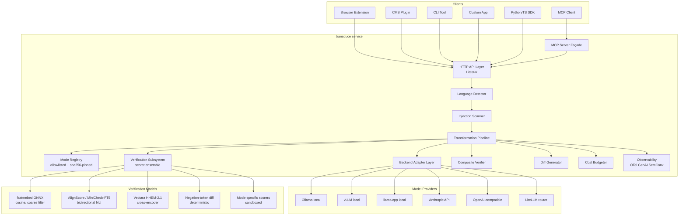
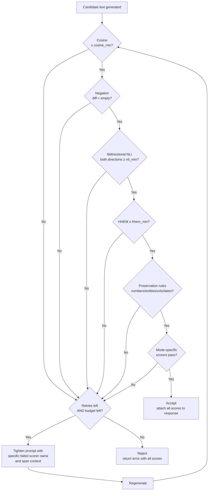
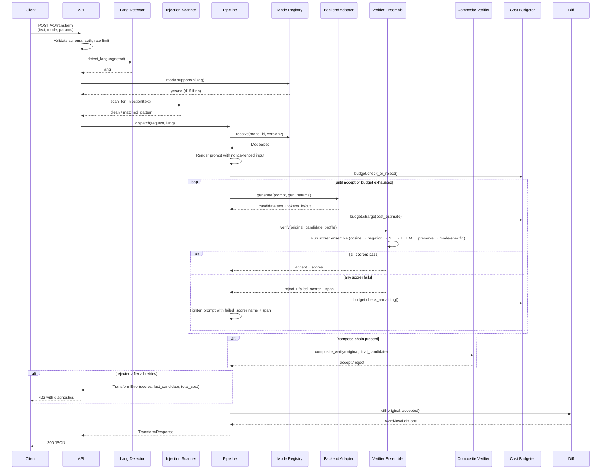
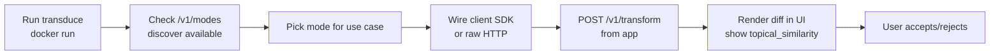
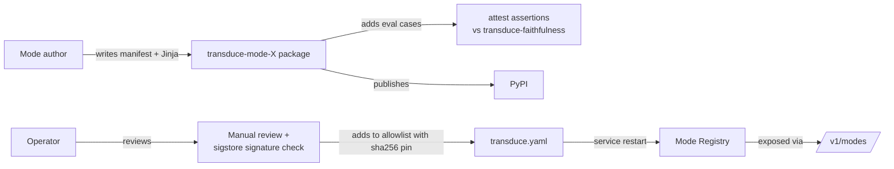
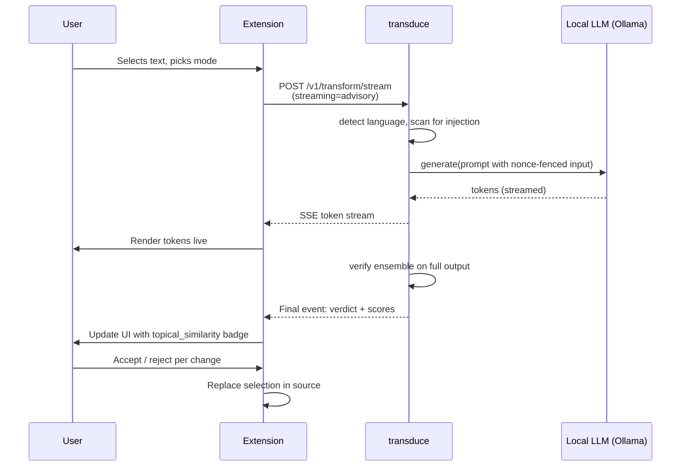
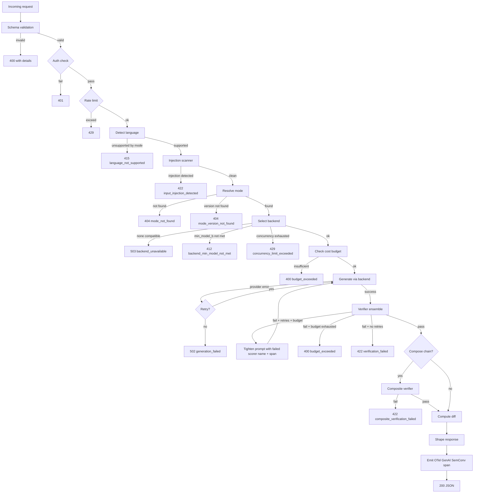
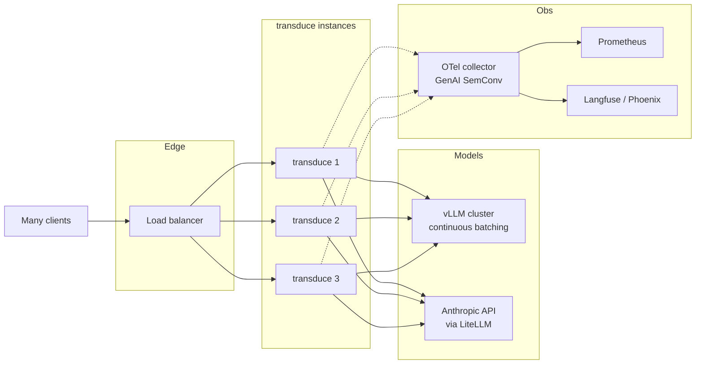

# transduce — System Design

> **Tagline:** Change the form. Conserve the signal.
> **Scope of this document:** Architecture, component design, data models, API surface, workflows, deployment topologies.

---

## Design Principles

These constrain every decision below.

| Principle | Concrete consequence |
|---|---|
| **One verb: transform** | No CRUD on documents. No user accounts in core. No history. Stateless API. |
| **Modes are data, not code paths** | Adding a mode never requires editing core. Modes are loaded from an explicit allowlist with sha256 pinning — never auto-discovered from `pip install`. |
| **Verification is an ensemble, not a single metric** | Cosine similarity is a coarse filter; NLI (AlignScore / MiniCheck-FT5) is the primary faithfulness signal; negation-token diff is a deterministic floor; HHEM and preservation regexes round out the ensemble. The design rejects single-scorer verification by construction. |
| **User input is fenced from instruction prompts** | Spotlighting with per-request nonce sentinels. The model is instructed to refuse instructions inside the fence. An ingress injection scanner runs before generation. |
| **Backends are interchangeable** | Same mode, same input, different backend → comparable output. Never lock to one provider. |
| **Local-first as a privacy choice, not a cost claim** | Ollama is the embedded/single-user reference; vLLM is the multi-tenant reference; cloud adapters (Anthropic, OpenAI-compat, LiteLLM router) are first-class. |
| **Fail loudly, return diffs, return cost** | Drift caught before response. Diff, per-scorer scores, retry count, language, and cost are part of the contract. |
| **Composition is explicit** | Compose chains are an API field, not a hand-rolled client loop. The composite verifier compares the final output against the original input — not just pairwise stages. |
| **Streaming and verification are architecturally distinct** | Strict verification is non-streaming by design. Advisory verification ships in v1 for clients that need first-token latency. |
| **Cost is bounded** | Every request has a `max_cost_per_request_usd` budget; retry loops abort on non-improving similarity trends. |

---

## High-Level Architecture



### Layer responsibilities

| Layer | Responsibility | Does NOT |
|---|---|---|
| HTTP API | Request validation, auth, rate limiting, response shaping, OpenAPI surface | Touch model providers; know about modes |
| MCP Server Façade | Expose modes as MCP tools; route to HTTP API internally | Implement transformation logic |
| Language Detector | Identify input language; reject 415 if mode does not declare support | Translate; alter input |
| Injection Scanner | Pre-generation scan for prompt-injection markers; reject 422 with `INPUT_INJECTION_DETECTED` | Generate text; verify output |
| Pipeline | Orchestrate the 7-stage flow; manage retries with targeted feedback; emit OTel spans | Generate text; compute scores |
| Mode Registry | Load allow-listed packages by sha256 pin; resolve mode IDs to specs; multi-version dispatch | Execute prompts; auto-discover plugins |
| Backend Adapters | Wrap provider APIs; uniform `generate(prompt, params) → text`; per-backend prompt overrides via name-suffix dispatch | Know about modes or verification |
| Verification Subsystem | Run scorer ensemble; aggregate verdict; emit per-scorer scores; suggest targeted prompt tightening | Generate text |
| Composite Verifier | Run end-to-end check against original input across compose chain | Pairwise verification (handled by per-stage Verification) |
| Diff Generator | Word-level diff with semantic cleanup | Anything else |
| Cost Budgeter | Track cumulative cost across retries; abort on budget exceeded or non-improving trend | Make routing decisions |
| Observability | OTel GenAI SemConv spans (`gen_ai.*` + `transduce.*`), metrics, structured logs with PII redaction | Make decisions |

Each layer is independently testable. No layer reaches across.

---

## Component Detail

### Mode Registry

A mode is a **declarative specification**, primarily expressed as a manifest. Python plugins are the reserved escape hatch and run in a subprocess sandbox.

```python
# Pseudocode for mode shape
class ModeSpec(BaseModel):
    id: str                              # "dejargon"
    version: str                         # SemVer
    description: str
    prompt_template: str                 # Jinja2 with input/preserve/intensity/nonce variables
    intensity_range: tuple[float, float] = (0.0, 1.0)
    preserve_defaults: list[PreserveRule]
    backend_requirements: BackendReq     # min_model_b, capabilities
    verifier_profile: VerifierProfile    # threshold map per scorer
    supported_languages: list[str]       # e.g., ["en"], ["en", "de", "fr"]
    metadata: dict[str, Any]             # license, author, repo, signed_by


class VerifierProfile(BaseModel):
    cosine_min: float = 0.85             # coarse filter only
    nli_min: float = 0.70                # AlignScore / MiniCheck head
    hhem_min: float = 0.50               # Vectara HHEM probability of factuality
    reject_on_negation_diff: bool = True # deterministic floor
    mode_specific_scorers: list[ScorerRef] = []
    judge_rubric: str | None = None      # optional LLM-judge rubric
    composite_threshold: float | None = None  # for compose chains
```

**Mode loading is allowlist-first.**

```yaml
# transduce.yaml — mode allowlist with sha256 pins
modes:
  source: allowlist                       # never "auto"
  packages:
    - name: transduce-modes-core
      version: "1.0.0"
      sha256: "9c2e..."
      signed_by: "determ-ai"              # sigstore identity
    - name: transduce-mode-dejargon
      version: "1.3.0"
      sha256: "a14f..."
  python_plugins:
    sandbox: subprocess                   # never inline
    strip_env_vars:
      - ANTHROPIC_API_KEY
      - OPENAI_API_KEY
      - "*_TOKEN"
      - "*_SECRET"
```

Manifest-only modes ship as a single TOML + Jinja template inside an allow-listed package. They never execute Python at registry-load time. Python scorers (the reserved escape hatch) run in a subprocess with `multiprocessing.Process` or via `RestrictedPython`-style sandboxing, with the env stripped of secrets.

The registry **does not** walk arbitrary `transduce.modes` entry points. Auto-discovery is explicitly disabled in the default config to prevent the supply-chain class of attack documented in the risks table.

**Multi-version dispatch.** Modes can be vendored under versioned import paths (`transduce_modes._dejargon_v1`, `_v2`) so a single service holds multiple versions simultaneously. Clients pin via `mode: "dejargon@1.3.0"` and rollback is a config change, not a `pip install --downgrade` race.

### Backend Adapter Layer

Single interface, multiple implementations, with **dbt-style adapter dispatch** for prompt overrides.

```python
class Backend(Protocol):
    name: str
    capabilities: BackendCapabilities    # streaming, tool-use, json-mode, attention-output

    async def generate(
        self,
        prompt: str,
        *,
        max_tokens: int,
        temperature: float,
        stop: list[str] | None = None,
        stream: bool = False,
    ) -> GenerationResult: ...

    async def stream(
        self, prompt: str, **params
    ) -> AsyncIterator[GenerationChunk]: ...

    async def health(self) -> BackendHealth: ...

    def cost_estimate(self, tokens_in: int, tokens_out: int) -> float | None: ...
```

Implementations: `OllamaBackend`, `VLLMBackend`, `LlamaCppBackend`, `AnthropicBackend`, `OpenAICompatBackend`, `LiteLLMBackend`. Each ~150 LOC. The pipeline never knows which is in use.

**Prompt-template dispatch** mirrors dbt's macro multiple-dispatch: a mode can ship a base `prompt.dejargon` and per-backend overrides (`prompt.dejargon.qwen2_5`, `prompt.dejargon.claude_sonnet`). The registry resolves to the most-specific available template at runtime.

**Routing rules** (in order):

1. Explicit `backend` field in request → use it
2. Mode's `backend_requirements.min_model_b` checked against the configured backend; reject 412 if unmet
3. Service-level default (`config.default_backend`)

**Concurrency control**: each backend has a configurable semaphore. Requests beyond the semaphore return 429 with `Retry-After`, never block on Litestar timeouts. Documented per-topology — Ollama serializes per model, so the semaphore should be 1; vLLM batches, so the semaphore can be much larger.

### Language Detection

A 1ms fasttext-langid pass at ingress identifies the input language. The mode registry exposes `supported_languages` per mode; if the detected language is not declared, the API rejects with **415 Unsupported Media Type** and `error: language_not_supported`. The verifier then routes to a language-appropriate embedding/NLI model:

| Language scope | Embedder | NLI |
|---|---|---|
| English-only | `bge-small-en-v1.5` | `cross-encoder/nli-deberta-v3-small` |
| Multilingual | `bge-m3` | `mDeBERTa-v3-xnli` |

### Injection Scanner

A pre-generation scan runs before any prompt is rendered. Defaults include:

- Pattern-based detection (LLM Guard / prompt-armor signatures): role-flip phrases, system-prompt leaks, `Ignore the above`-style imperatives.
- Length sanity: input must be <= `service.max_input_chars` (default 50_000).
- Sentinel-conflict detection: input must not contain the per-request nonce that will fence it (regenerate the nonce until disjoint).

On hit, the API returns 422 with `error: input_injection_detected` and the matched pattern category in `details`. Documentation states explicitly that this is a defense-in-depth layer, not a safety boundary.

### Verification Subsystem

Verification is a **scorer ensemble** that produces a structured verdict, not a single number.



Default scorers shipped in core:

| Scorer | Purpose | Default threshold | Latency (CPU) |
|---|---|---|---|
| `CosineSimilarityScorer` | Coarse topical-similarity filter (fastembed bge-small or bge-m3) | ≥ 0.85 | ~10 ms |
| `NegationDiffScorer` | Reject if any negation cue (`not, never, no, n't, without, fail to, unable, cannot`) is added or removed between original and candidate | strict | <1 ms |
| `BidirectionalNLIScorer` | AlignScore or MiniCheck-FT5; require both `original ⊨ candidate` AND `candidate ⊨ original` | ≥ 0.70 each direction | ~30 ms |
| `HHEMScorer` | Vectara HHEM-2.1 cross-encoder; probability of factuality vs source | ≥ 0.50 | ~30 ms |
| `EntityPreservationScorer` | Named entities (spaCy) present in both, with exact-string match (no substring fuzzing) | 1.0 | ~5 ms |
| `NumberPreservationScorer` | Decimal-aware extraction; `(value, unit, magnitude)` triples must match | 1.0 | <1 ms |
| `UrlPreservationScorer` | All URLs present in both | 1.0 | <1 ms |
| `DatePreservationScorer` | Explicit dates and temporal markers (`Q3 2025`, `last quarter`) preserved when mode opts in | 1.0 | <1 ms |
| `LengthDeltaScorer` | Output within configured length range; caps maximum length to prevent injection-style padding | mode-defined | <1 ms |
| `SelfCheckGPTScorer` | Optional: N-sample agreement scoring across `N=3` regenerations | mode-defined | reuses generation budget |
| `LookbackLensScorer` | Optional, local-backends-only: linear probe on attention-weight ratio | mode-defined | <1 ms (when attention is exposed) |
| `LLMJudgeScorer` | Optional: LLM-as-judge with mode-supplied rubric | mode-defined | ~1 generation |

Modes can register custom scorers via the same allowlist mechanism (`transduce.scorers` declared in `transduce.yaml`, sha256-pinned, sandboxed).

**Targeted retry feedback.** When a scorer rejects, the failure context names the *specific scorer* and the *span of text* that failed (e.g., "negation cue inserted at character 42"). The retry prompt is tightened with this exact information. This is the difference between the Huang et al. (ICLR 2024) anti-pattern of intrinsic self-correction and the CRITIC-style external-feedback loop that has empirical support.

**Latency budget**: the example response shows verify=47ms; the new ensemble fits within ~120ms total CPU budget (10 + 1 + 30 + 30 + 5 + 1 = 77ms, plus orchestration). For backends that exceed 1s generation, the verifier is still <10% of latency.

### Composite Verifier

For compose chains (`mode: ["dejargon", "register.casual", "inject.contractions"]`), the per-stage verifier ensures stage-local validity. The **composite verifier** runs after the final stage and compares the final output to the *original* input across the full chain.

```python
class CompositionRequest(BaseModel):
    text: str
    pipeline: list[str | ModeRef]
    intensity: float = 0.5  # multiplicatively distributed across stages
    composite_threshold: float = 0.80  # default: min_step_threshold - 0.05
```

**Intensity composition** is multiplicative-with-clamp: `effective_per_stage = 1 - (1 - global_intensity) ** (1/n_stages)`. Per-stage intensity ≤ global intensity by construction.

**Preservation rules** union across stages: any stage requiring entity preservation enforces it on the final output, not just on the stage-local pair.

**On composite failure**, the retry strategy targets the most-recently-edited stage first, then re-runs subsequent stages.

### Diff Generator

Word-level diff using `diff-match-patch-python` (the actively maintained fork) with semantic cleanup post-processing to factor out coincidental commonalities. Returned as a structured array of operations:

```python
class DiffOp(BaseModel):
    op: Literal["equal", "insert", "delete"]
    text: str
```

Clients render the diff however they want (yellow highlights, inline strikethrough, GitHub-style two-pane). The service never renders.

### Cost Budgeter

Every request carries a budget envelope. The budgeter:

- Estimates per-call cost using the backend's `cost_estimate(tokens_in, tokens_out)`.
- Tracks cumulative spend across retries.
- Aborts the retry loop when cumulative cost exceeds `max_cost_per_request_usd` (config default: $0.05; can be set per-mode).
- Aborts when the verifier scores trend non-improvingly across the last 3 retries (the model has converged on a wrong answer).
- Emits `transduce_generation_cost_usd_total{backend, mode}` for fleet-wide cost observability.

---

## Request Lifecycle



Notable properties:

- **Stateless.** No request state survives the response. Retries are in-pipeline only.
- **Bounded.** Default max retries = 3. Hard ceiling = 5. Cost ceiling: `max_cost_per_request_usd`.
- **Observable.** Every stage emits OTel GenAI SemConv spans with `gen_ai.*` attributes plus `transduce.*` extensions.
- **Fail-fast on schema, language, and injection.** Bad input never reaches generation.

---

## Data Models

### TransformRequest

```python
class TransformRequest(BaseModel):
    text: str = Field(min_length=1, max_length=50_000)
    mode: str | list[str | ModeRef]              # single mode or compose chain
    intensity: float = Field(0.5, ge=0.0, le=1.0)
    preserve: list[PreserveRule] = Field(default_factory=list)
    backend: BackendOverride | None = None
    verification: VerificationOverride | None = None
    streaming: StreamingMode = StreamingMode.OFF  # OFF | ADVISORY (v1) | STRICT (non-streaming)
    return_fields: set[ReturnField] = {"text", "diff", "scores", "cost"}
    request_id: str | None = None                 # client-supplied for tracing
    max_cost_usd: float | None = None             # caller override of budget


class PreserveRule(StrEnum):
    ENTITIES = "entities"
    NUMBERS = "numbers"
    URLS = "urls"
    DATES = "dates"
    CODE_BLOCKS = "code_blocks"
    TEMPORAL_MARKERS = "temporal_markers"  # Q3, last quarter, fiscal year, etc.


class BackendOverride(BaseModel):
    provider: Literal["ollama", "vllm", "llama_cpp", "anthropic", "openai_compat", "litellm"]
    model: str
    endpoint: HttpUrl | None = None


class VerificationOverride(BaseModel):
    enabled: bool = True
    cosine_min: float | None = None
    nli_min: float | None = None
    hhem_min: float | None = None
    composite_threshold: float | None = None
    max_retries: int = Field(3, ge=0, le=5)
    advisory: bool = False  # if True, scores are reported but never gate output


class StreamingMode(StrEnum):
    OFF = "off"
    ADVISORY = "advisory"   # stream tokens; verify after; report verdict as final event
    STRICT = "strict"       # alias for OFF; explicit
```

### TransformResponse

```python
class TransformResponse(BaseModel):
    request_id: str
    mode: ModeRef | list[ModeRef]                 # resolved id + version (chain if composed)
    language: str                                 # detected, e.g., "en"
    original: str
    transformed: str
    diff: list[DiffOp]
    scores: VerificationScores
    backend_used: BackendInfo
    timing: TimingBreakdown                       # ms per stage
    retries: int
    cost: CostBreakdown                           # per-call and total
    composite_score: float | None = None          # only for compose chains


class VerificationScores(BaseModel):
    cosine: float
    nli_forward: float
    nli_backward: float
    hhem: float
    negation_diff: NegationDiffResult             # added/removed cues
    preserved: dict[str, bool]                    # per-rule outcome
    mode_specific: dict[str, float]               # custom scorer outputs
    topical_similarity: float                     # primary client-facing aggregate
    verdict: Literal["accept", "reject", "advisory"]
    rejection_reason: str | None = None           # name of first failing scorer


class CostBreakdown(BaseModel):
    tokens_in_total: int
    tokens_out_total: int
    usd_total: float
    by_attempt: list[AttemptCost]
```

The aggregate field is named `topical_similarity`, not `verdict_confidence` or `semantic_similarity`. The naming is deliberate: clients confront the limit of the metric. A signed-off verdict-style "accept" is reserved for cases where every ensemble scorer passes.

### TransformError

```python
class TransformError(BaseModel):
    error: ErrorCode
    message: str
    details: dict[str, Any] | None = None
    last_candidate: str | None = None
    scores: VerificationScores | None = None
    cost: CostBreakdown | None = None


class ErrorCode(StrEnum):
    MODE_NOT_FOUND = "mode_not_found"
    MODE_VERSION_NOT_FOUND = "mode_version_not_found"
    BACKEND_UNAVAILABLE = "backend_unavailable"
    BACKEND_MIN_MODEL_NOT_MET = "backend_min_model_not_met"  # 412
    VERIFICATION_FAILED = "verification_failed"
    COMPOSITE_VERIFICATION_FAILED = "composite_verification_failed"
    INPUT_TOO_LONG = "input_too_long"
    INPUT_INJECTION_DETECTED = "input_injection_detected"    # 422
    LANGUAGE_NOT_SUPPORTED = "language_not_supported"        # 415
    BUDGET_EXCEEDED = "budget_exceeded"
    GENERATION_FAILED = "generation_failed"
    CONCURRENCY_LIMIT_EXCEEDED = "concurrency_limit_exceeded" # 429
    TIMEOUT = "timeout"
```

---

## API Surface

Minimal, versioned, stable.

| Method | Path | Purpose |
|---|---|---|
| `POST` | `/v1/transform` | Run a transformation (single mode or compose chain) |
| `POST` | `/v1/transform/batch` | Batch up to 32 requests (v1.5) |
| `POST` | `/v1/transform/stream` | Streaming transformation with advisory verification |
| `POST` | `/v1/modes/{id}/render` | Mode-introspection: render the prompt without executing inference |
| `GET` | `/v1/modes` | List registered modes with metadata, supported languages, signed-by status |
| `GET` | `/v1/modes/{id}` | Mode detail (spec, version, requirements, compatible backends) |
| `GET` | `/v1/backends` | List configured backends and health |
| `GET` | `/v1/scorers` | List available verification scorers |
| `GET` | `/healthz` | Liveness |
| `GET` | `/readyz` | Readiness (backends reachable, modes loaded, allowlist verified) |
| `GET` | `/metrics` | Prometheus metrics |
| MCP | (via `transduce mcp serve`) | Modes exposed as MCP tools, parameters mapped from `TransformRequest` schema |

Auth is pluggable. Default: none (local-only deployment). Optional: bearer token middleware. Multi-tenant auth is a v2 concern, not core.

### Example: minimal request

```http
POST /v1/transform HTTP/1.1
Content-Type: application/json

{
  "text": "I wanted to reach out to express my interest in connecting regarding potential synergies between our organizations.",
  "mode": "register.casual",
  "intensity": 0.6
}
```

### Example: response

```json
{
  "request_id": "01HX2K...",
  "mode": {"id": "register.casual", "version": "1.0.0"},
  "language": "en",
  "original": "I wanted to reach out to express my interest...",
  "transformed": "Wanted to ask about potential ways we could work together.",
  "diff": [
    {"op": "delete", "text": "I wanted to reach out to express my interest in connecting regarding potential synergies between our organizations."},
    {"op": "insert", "text": "Wanted to ask about potential ways we could work together."}
  ],
  "scores": {
    "cosine": 0.91,
    "nli_forward": 0.88,
    "nli_backward": 0.85,
    "hhem": 0.74,
    "negation_diff": {"added": [], "removed": []},
    "preserved": {"entities": true, "numbers": true, "urls": true, "dates": true},
    "mode_specific": {"register_shift": 0.78},
    "topical_similarity": 0.91,
    "verdict": "accept"
  },
  "backend_used": {"provider": "ollama", "model": "qwen2.5:14b"},
  "timing": {"lang_ms": 1, "scan_ms": 4, "resolve_ms": 2, "generate_ms": 1840, "verify_ms": 78, "diff_ms": 3},
  "retries": 0,
  "cost": {
    "tokens_in_total": 42,
    "tokens_out_total": 18,
    "usd_total": 0.000000,
    "by_attempt": [{"attempt": 1, "usd": 0.000000}]
  }
}
```

### Streaming with advisory verification

```http
POST /v1/transform/stream HTTP/1.1
Content-Type: application/json

{
  "text": "...",
  "mode": "register.casual",
  "streaming": "advisory"
}
```

Response is `text/event-stream`. Token chunks stream as they are generated. The final event carries the verifier verdict as metadata; if the verdict is "reject," the client can roll back the streamed text. Strict verification remains non-streaming by design.

---

## User Workflows

### Developer integrating transduce



### Mode contributor adding a new mode



A mode package is ~3 files: `pyproject.toml`, `mode.toml` with the manifest, `prompts/<id>.j2` template, optional `tests/` with eval cases. Manifest-only modes never execute Python at registry-load. Operators add modes to the allowlist via PR review; the contribution barrier is "low for mode authors, gated for operators" — and the attack surface is bounded.

### End-user roundtrip (e.g., browser extension built on transduce)



The extension is dumb. The intelligence is in `transduce`.

---

## System Workflow — Full Internal Flow



---

## Configuration

YAML or env vars. YAML preferred; env overrides for container deployments.

```yaml
# transduce.yaml
service:
  host: 0.0.0.0
  port: 8080
  request_timeout_s: 30
  max_input_chars: 50000
  max_cost_per_request_usd: 0.05
  max_retries_default: 3

modes:
  source: allowlist                       # never "auto"
  enforce_signing: true                   # production default
  packages:
    - name: transduce-modes-core
      version: "1.0.0"
      sha256: "9c2e..."
      signed_by: "determ-ai"
    - name: transduce-mode-dejargon
      version: "1.3.0"
      sha256: "a14f..."
  python_plugins:
    sandbox: subprocess
    strip_env_vars:
      - "ANTHROPIC_API_KEY"
      - "OPENAI_API_KEY"
      - "*_TOKEN"
      - "*_SECRET"

backends:
  default: ollama_qwen
  registry:
    - id: ollama_qwen
      provider: ollama
      endpoint: http://localhost:11434
      model: qwen2.5:14b
      concurrency_limit: 1               # Ollama serializes per-model
    - id: vllm_qwen
      provider: vllm
      endpoint: http://localhost:8000
      model: Qwen/Qwen2.5-14B-Instruct
      concurrency_limit: 32              # vLLM batches
    - id: anthropic_haiku
      provider: anthropic
      api_key_env: ANTHROPIC_API_KEY
      model: claude-haiku-4-5
      concurrency_limit: 16
    - id: litellm_router
      provider: litellm
      config_path: ./litellm.yaml

verification:
  enabled: true
  embedder_en: BAAI/bge-small-en-v1.5
  embedder_multi: BAAI/bge-m3
  nli_model: lytang/MiniCheck-Flan-T5-Large
  hhem_model: vectara/hallucination_evaluation_model
  injection_scanner: prompt-armor
  default_cosine_min: 0.85
  default_nli_min: 0.70
  default_hhem_min: 0.50
  reject_on_negation_diff: true
  max_retries: 3
  abort_on_non_improving_trend: true     # last 3 retries must improve

observability:
  otel_endpoint: http://localhost:4317
  semconv: gen_ai                        # GenAI SemConv compliant
  log_level: INFO
  metrics_enabled: true
  redact_text_in_spans: true             # ban raw text from span attributes
  debug_include_text: false              # never enable in production

language:
  detector: fasttext-langid
  default: en
```

---

## Deployment Topologies

Three supported, in increasing operational weight.

### 1. Embedded library

```python
from transduce import Transducer

t = Transducer.from_config("transduce.yaml")
result = await t.transform(text="...", mode="register.casual")
```

For Python apps that want zero network hop. Ships as `pip install transduce`. Backend default: Ollama on localhost.

### 2. Local single-process service

```bash
docker run -p 8080:8080 \
  -v ./transduce.yaml:/etc/transduce/config.yaml \
  --network host \
  ghcr.io/determ-ai/transduce:latest
```

For users running Ollama on `localhost:11434` and wanting the API surface for browser extensions or local clients.

### 3. Self-hosted multi-client server



For org-internal deployment serving multiple internal tools. Stateless, so horizontal scaling is trivial. **vLLM is the documented production backend at this topology** because Ollama serializes per-model and lacks continuous batching — a single-instance Ollama deployment will not survive even modest concurrent load. The earlier topology diagram showing "Ollama cluster" was aspirational and is not supported by Ollama's actual concurrency model.

---

## Observability

OTel GenAI SemConv compliant from v1. Every request emits a parent span with child spans per stage. Attributes follow the `gen_ai.*` namespace; transduce-specific extensions sit under `transduce.*`.

| Span | Standard attributes | Transduce extensions |
|---|---|---|
| `gen_ai.client.request` | `gen_ai.system`, `gen_ai.request.model`, `gen_ai.usage.input_tokens`, `gen_ai.usage.output_tokens`, `gen_ai.response.finish_reasons` | `transduce.mode.id`, `transduce.mode.version`, `transduce.language`, `transduce.verdict`, `transduce.retries`, `transduce.cost_usd` |
| `transduce.scan` | — | `transduce.scan.matched_pattern` (or "clean") |
| `transduce.generate` | `gen_ai.usage.*`, `gen_ai.response.finish_reasons` | `transduce.attempt`, `transduce.cost_usd` |
| `transduce.verify` | — | `transduce.scorer.cosine`, `transduce.scorer.nli_forward`, `transduce.scorer.nli_backward`, `transduce.scorer.hhem`, `transduce.scorer.negation_diff_count`, `transduce.verdict`, `transduce.rejection_reason` |
| `transduce.compose` | — | `transduce.compose.stages`, `transduce.compose.drift_total` |
| `transduce.diff` | — | `transduce.diff.ops_count`, `transduce.diff.chars_changed` |

**Raw text and `last_candidate` are banned from span attributes.** Replaced with `transduce.text.sha256_8` (8-hex-char prefix of sha256) and `transduce.text.length`. An opt-in `debug.include_text: true` flag exists for non-prod debugging only.

Metrics exposed at `/metrics`:

- `transduce_requests_total{mode, verdict}`
- `transduce_generation_duration_ms{backend, mode}`
- `transduce_verification_failures_total{mode, scorer}`
- `transduce_retry_count{mode}`
- `transduce_generation_cost_usd_total{backend, mode}`
- `transduce_concurrency_rejections_total{backend}`
- `transduce_injection_detected_total{pattern_category}`
- `transduce_language_unsupported_total{mode, lang}`

This is the data needed to evaluate mode quality, security posture, and operational health in production. It feeds back into `attest` evals and `anneal` optimization.

---

## What This Design Deliberately Excludes

| Excluded | Why |
|---|---|
| User accounts, multi-tenancy in core | Push to v2; most deployments are single-tenant |
| Document storage | Stateless service. Storage is the client's job. |
| UI / web interface | Defeats the "primitive" positioning |
| Auto-discovery of plugins from `pip install` | Supply-chain attack surface; replaced with explicit allowlist + sha256 + signing |
| `humanize.*` modes in core | Detection arms race compresses value; ethical drag risks brand contamination; ships as third-party |
| Built-in fine-tuning | Out of scope; modes use prompt engineering |
| Detection-evasion guarantees | Explicit non-goal |
| Strict verification + token streaming | Architecturally incompatible. Advisory verification mode covers the streaming case |
| Mode marketplace UI | Plugin system suffices for v1; marketplace is community-owned |
| Raw text in observability spans | Privacy by default; opt-in only for non-prod debugging |
| Safety-boundary claims against hostile input authors | Documented explicitly. Spotlighting + injection scanner are defense-in-depth, not guarantees |

Each exclusion is a refusal to expand scope past "transformation primitive." Each addition versus the original draft (allowlist, ensemble verifier, injection fence, composite verifier, cost budget, language detection, GenAI SemConv) is a refusal to ship a primitive that fails in production on its first contact with a hostile input, a small model, or a financial document.
